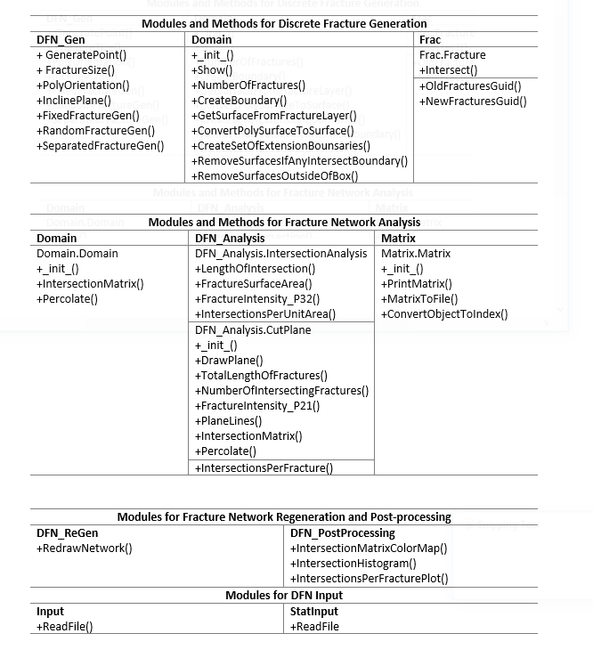

# A Discrete Fracture Network Generation and Analysis Library for Use in CAD Software Environments

# Author: 

Name: Falola Yusuf

Email address: fyf17@ic.ac.uk

CID: 01481781

# Introduction

This work introduces an easy to use, open sourced library, Y-Frac, for DFN modelling and analysis. Y-Frac is built upon the python APIs available on Rhinoceros 6. Hence, Y-Frac is fit for use on Rhinoceros software package. Y-Frac can model fracture networks containing circular, elliptical and regular polygonal fractures. This library is computationally cheap for DFN modelling and analysis. Some of the functionalities of this library for DFN analysis include fracture intersection analysis, cut-plane analysis, and percolation analysis. Algorithms for constructing an intersection matrix and determining percolation state of a fracture network are also included in this work. The output text file from this library containing modelled fracture networks’ parameters can serve as input for appropriate software packages to simulate flow and perform mechanical analysis in fracture networks. The practical applicability of Y-Frac was demonstrated by performing percolation threshold analysis of 3D fracture networks and comparing the results to published data. 

# Requirements
This software expands on Rhiniceros (Rhino) 6 python API. Hence, users need to install the software before using this library.

- Rhinoceros 6, can be donloaded [here](https://www.rhino3d.com/download)
- Rhinoceros 6 hardware requirements can be found [here](https://www.rhino3d.com/6/system_requirements)
- matplotlib >= 3.0.2 for postprocessing

# Installation
- Clone this repository to your computer using the following on the command line.

`git clone http://github.com/msc-acse/acse-9-independent-research-project-Falfat.git`

- The contents in the file should be copied to the Rhinoceros 6 script folder for use, as described below

`~\McNeel\Rhinoceros\6.0\scripts`

# Usage
- Once the files are in the Rhino's script folder. Users should open the Rhino software and maneuver to the Rhino python scripting platform, described as follows

` Tools >> PythonScript >> Edit `

- A second interface will pop up for python scripting. Users can then access the Rhinopython script folder by clicking

`File >> Open >> ~\McNeel\Rhinoceros\6.0\scripts`

- A new file can the be open to access the Y-Frac modules saved in the Y-Frac folder. To open a new Rhino python scripting file:

`File >> New..`

- The Rhino python scripting platform does not support matplotlib package for visualisations. Therefore, the postprocesing module `PostProcessing.py` should be used on a IDE that supports matplotlib.

- The `input_file` folder contains two text files that serve as to specify fracture parameters and statistical distribution for the library. It is advisable that these files should be copied to the Y-Frac folder for easy access by the modules. The instructions on how to fill these text files is contained in the files.

- Y-Frac outputs a text file which contains domain size, fracture_shape, fracture orienations, planes and sizes for fracture regeneration and input to more complex software packages for flow simulation and geomechanical anlysis of fracture networks.

- The `percolation_analysis` and `analysis_script` folders some contain DFN analysis done with Y-Frac. Each of the file is well commented to describe the analysis contained in it.

- The `text_files` folder contain is where the output file named `fracture_data` is written. It also contains some text files used for analysis to demonstrated Y-Frac's functionalities. Again, it is prefered this folder be copied into `Y-Frac` folder for easy accessibility.

# Documentation
- Full documentation is available in `Y-Frac.html` in `documentation` file.

- Below is the architecture of Y-Frac's library

- The table shows the basic methods and functions contained in each module, and the general functioonalities of each module.
